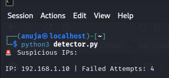

# 🔐 Failed Login Detection System

## 📌 Description
This project detects suspicious login activity by analyzing system logs. It identifies IP addresses with multiple failed login attempts and flags them as potential attackers.

---

## 🚀 Features
- Detects failed login attempts from logs
- Tracks number of attempts per IP
- Identifies suspicious IPs using threshold
- Saves attacker IPs to a file
- Simple and efficient Python script

---

## 🛠️ Technologies Used
- Python
- System Logs (journalctl)

---

## ⚙️ How It Works
1. The script reads system logs using `journalctl`
2. It searches for "Failed password" entries
3. Extracts IP addresses from logs
4. Counts failed attempts for each IP
5. Flags IPs exceeding threshold (default = 3)

---

## 📂 Project Structure
```
detector.py                
logs.txt                  
attackers.txt             
failed-login-detection.png
```
---

## ▶️ How to Run

```bash
python3 detector.py
```

## 📊 Example Output
```
Suspicious IPs:
IP: 192.168.1.10 | Failed Attempts: 4
IP: 10.0.0.5 | Failed Attempts: 5
```
---

## 🖼️ Output Screenshot


---

## 🎯 Future Improvements
- Real-time monitoring system
- Email/SMS alerts
- Web dashboard using Flask
- Auto-block suspicious IPs
---

## 👩‍💻 Author
Anuja Gurav

